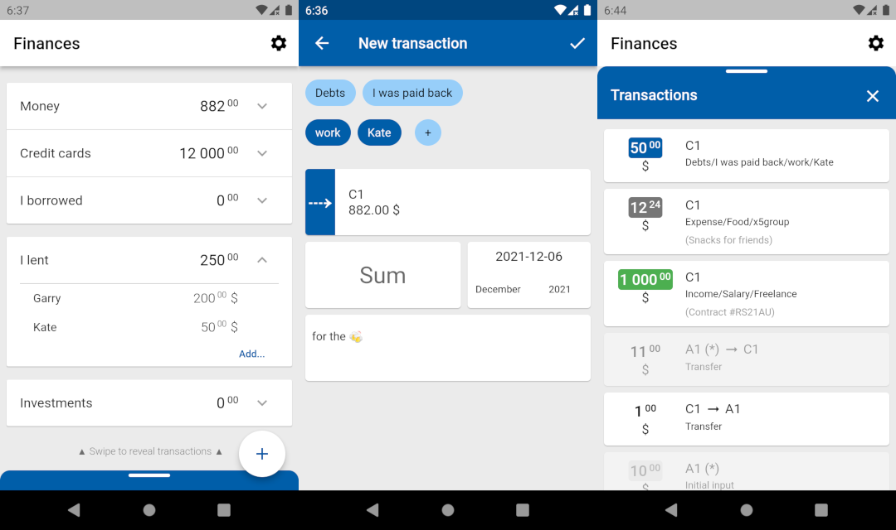

# Intelligent Individual Finance (IIF v2)

Hello everyone, that's my pet-project made in cooperation with my friend (not a programmer) - Victor N. who is an economist by vocation and of education.

The main goal of this app - is to provide convenient way to deal with personal budget (internal use only, no plans to sell it).

Currently the work is in progress, we meet some time, share our ideas and try to implement them to make us (and our personal budgets) happy:)

# Some screens of the app

# Other programmer's stuff

//tbd
